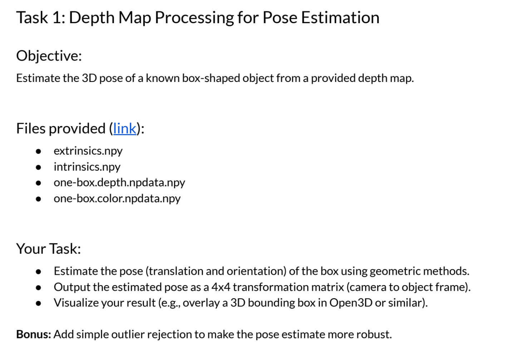
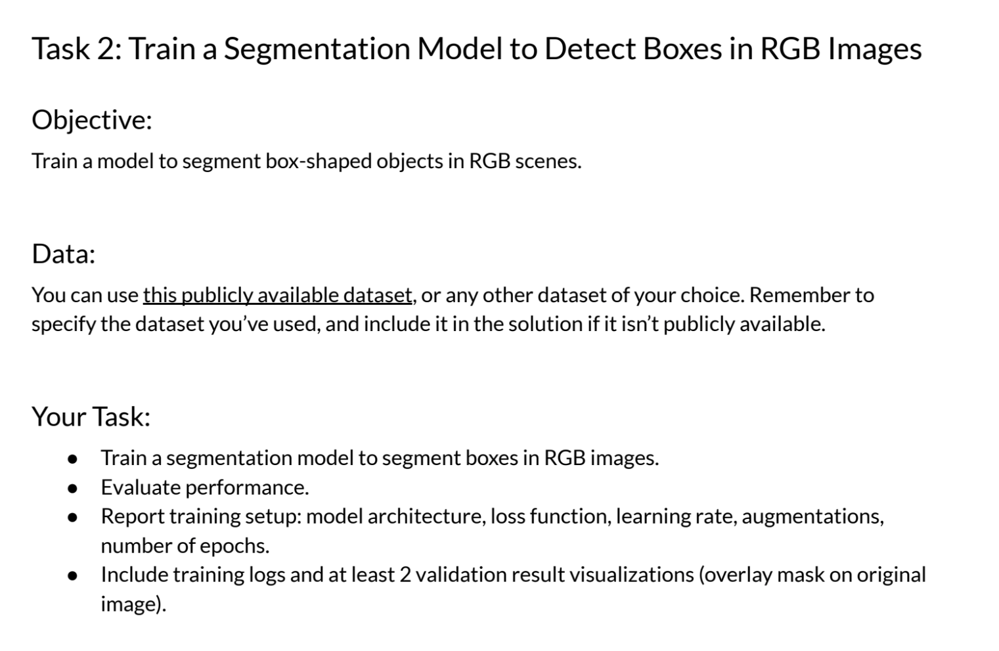
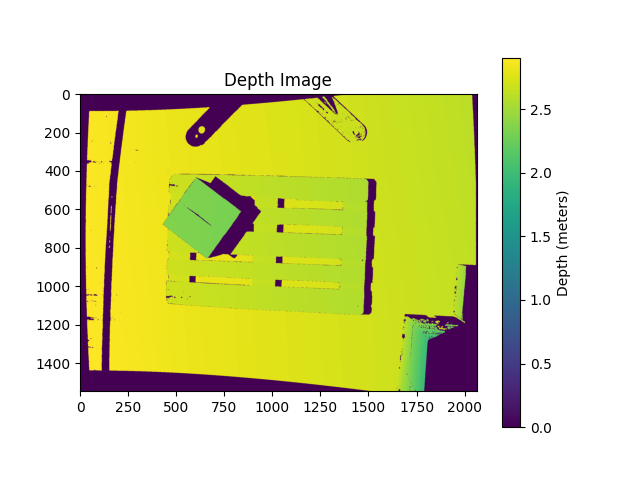
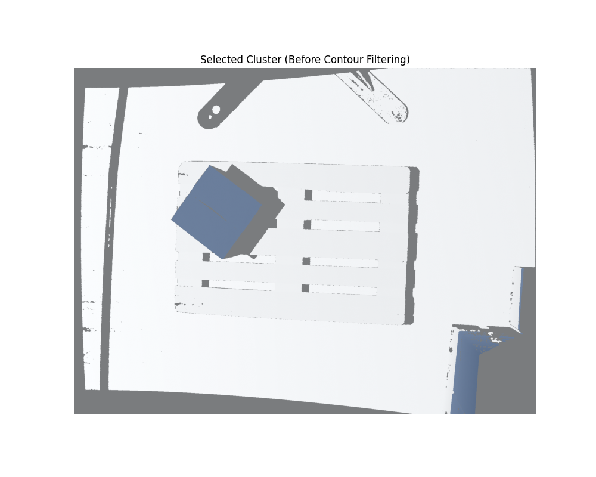
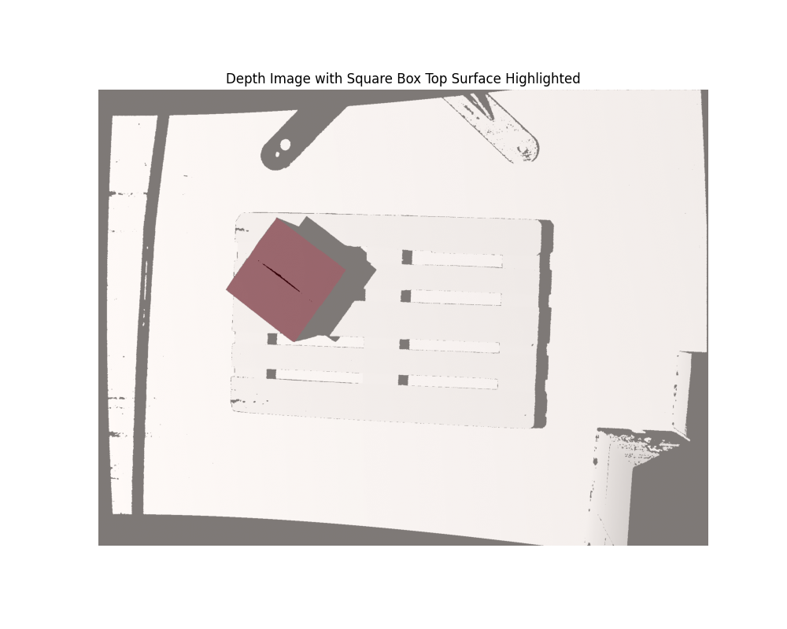
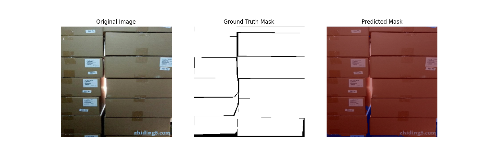
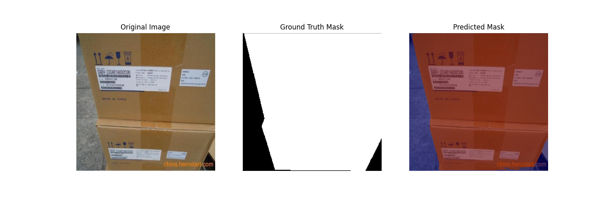

# Technical Assessment - Robotics Perception Engineer role at Jacobi Robotics (Hamburg, Germany)

This repository contains my solution for the technical assessment provided by Jacobi Robotics for the Robotics Perception Engineer role.

There are two tasks:
    
- 
- 

## Tested Environment

* OS: **Ubuntu 24.04 LTS**
* Python: 3.12
* Dependencies: please refer to `requirements.txt`

## How to use

1. cd to the project folder

```bash
cd robotics_perception
```

2. Set up the environment

```bash
pip install -r requirements.txt
```

3. Execute task 1

```bash
python3 src/task_1/analyse_input.py
python3 src/task_1/gernerate_model_xyzs.py
python3 src/task_1/pose_estimation.py
```

The script print out the transformation matrix to transform the box model point cloud to the box position in the scene data
Assuming: The frame of the box model is coincident with the frame of the camera. Origin point of the box's frame is at the center of gravity, z axis points up, other axises follow right-hand-rule.

After that, it will provide visualize over following link: http://localhost:7000

4. Execuate task 2
```bash
python3 src/task_2/train_segmantation_model.py
```

## My approach

### Task 1

#### 1. Analyse the input data `one-box.color.npdata.npy`:



At first glance, I see four groups of depth. So I use k-mean to cluster the depth
    
##### 1.1. Use k-mean to cluster the depth -> there are 4 groups:

- floor depth
- base depth
- box depth
- undefined depth

At this step, I got height of the box, also isolate the object with the approximately same depth/height


    
##### 1.2. Contour the box and get the approximate area of the top side



At this step, I got the area of the top side. Now I have full size of the box model. I created point cloud for box model which will be used in icp algorithm later

I also extract the point of interest from the scene cloud, only keep the point in the red square

#### 2. Gernerate the model box:

Nothing much to say here, I just create point cloud of box model using information extracted above.
[w x l x h] = [0.2963 m, 0.2963 m, 0.35 m]. 
Assuming unit intrinsic is milimeter. 
Set the frame of the box model coincident with the camera frame, as describe above.

#### 3. Perform ICP:
##### 3.1. Refine the clouds with outliner removal and down sampling

At this step I spend some time to tune the parameters:
- nb_neighbors
- std_ratio
- voxel_size

##### 3.2. Run ICP algorithm

At this step I tune:
- max_iterations
- tolerance

#### 4. Next step:

Actually I am not very happy with this approach. I rely deeply on the assumption that the box lays on a flat ground with slope approximately equal to 0*. I also get rid of the vertical 3d points belong to the box which are valueable for pose estimation.

My next step would be to train a model (task 2) to detect all the points that actually belong to the box.

### Task 2

#### Training Setup

##### 1. Model Architecture: U-Net with ResNet-32 backbone (segmentation_models_pytorch.Unet, encoder_name="resnet34", classes=1, activation="sigmoid").

##### 2. Loss Function: Binary Cross-Entropy with Logits (nn.BCEWithLogitsLoss).

##### 3. Learning Rate: 0.001 (Adam optimizer).

##### 4. Augmentations:

- Resize to 256x256.
- HorizontalFlip (p=0.5)
- RandomRotate90 (p=0.5)
- Normalize (mean=[0.485, 0.456, 0.406], std=[0.229, 0.224, 0.225]).

##### 5. Number of Epochs: 20

##### Batch size: 4

#### Evaluate Performance

##### 1. Metrics:

- Training Loss
- Validation Loss
- IoU

##### 2. Traing Logs:

[training log](log/training_logs.txt)

##### 3. Visualizations:






